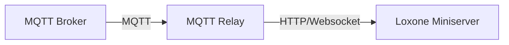
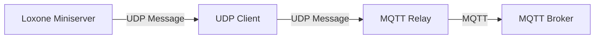

# MQTT Relay for Loxone

[](https://opensource.org/licenses/MIT)


[](https://hub.docker.com/r/acidcliff/loxmqttrelay)

This MQTT Relay enables seamless communication between your MQTT devices/services and Loxone Miniserver.
It is heavily insipred and based upon the extraordinary work of [Loxberry](https://github.com/mschlenstedt/Loxberry) - especially the MQTT Gateway.

The MQTT has been created with several goals in mind:
- Follow best practices established by the Loxberry community
- Providing isolated MQTT bridging capabilites for scenarios, where a full Loxberry installation is not necessary
- Enabling provisioning over Docker
- Optimizing for low power scenarios

To achieve these goals the MQTT Relay for Loxone uses more opionionted and minimalist approach:
1. Inbound communication with the MQTT Relay is done exclusively via UDP, with a reduced featureset compared to Loxberry
2. Outbound communication with the Miniserver is done exclusively via HTTP/Websocket (no UDP capability)
3. Interaction with the MQTT Relay is done primarily via MQTT, configuration is done exclusively via the `config.toml` file, but no integrated functionality like MQTT-Finder, Incoming Message Overview 
4. Except for boolean mapping and JSON flatteining, no transformers
5. No provisioning of an integrated packaged MQTT broker

The general mindset is to use MQTT Relay for Loxone in conjunctin with other tools:
- Using MQTT Monitoring tools like MQTT Explorer to find MQTT-Topics and get information about the processed and forwarded topics from the MQTT Relay
- Using middleware like Node-Red, Homeassistant for transformation of topics
- Using an external MQTT Broker of your choice

> ⚠️ **Disclaimer**: This project is not affiliated with, endorsed by, or connected to Loxone Electronics GmbH in any way. Loxone and Miniserver are trademarks of Loxone Electronics GmbH.

## Quick Start

### Run with docker (recommended)
```bash
# Create a configuration directory and copy the default config
mkdir -p config
curl -o config/config.toml https://raw.githubusercontent.com/Jakob-Gliwa/loxMqttRelay/main/config/default_config.toml

# Edit the config file with your settings
# nano config/config.toml

# Run the container
docker run -d \
  --name loxmqttrelay \
  --restart unless-stopped \
  -v $(pwd)/config:/app/config \
  -p 11884:11884/udp \
  acidcliff/loxmqttrelay

Optionally set -e LOG_LEVEL=DEBUG for more detailed logging
```

### Local installation
```bash
  1. Clone the repository:
    ```bash
    git clone https://github.com/Jakob-Gliwa/loxMqttRelay.git
    cd loxmqttrelay
    ```

  2. Copy the default configuration:
    ```bash
    cp config/default_config.toml config/config.toml
    ```

  3. Edit config/config.toml with your settings:
    ```toml
    [broker]
    host = "your-mqtt-broker"
    port = 1883
    
    [miniserver]
    miniserver_ip = "your-miniserver-ip"
    miniserver_user = "your-user"
    miniserver_pass = "your-password"
    ```

  4. Run:
    ```bash
    uv venv .venv 
    source .venv/
    bin/activate
    uv pip install .
    python loxmqttrelay
    ```
```
## Architecture

#### MQTT Subscribe

#### MQTT Publish



## Features

- Bidirectional communication between MQTT and Loxone
- Dynamic topic filtering and whitelisting
- JSON payload expansion for complex data structures
- Automatic boolean value conversion
- Live configuration updates via MQTT
- Automatic synchronization of whitelisted topics using the Miniserver configuration
- Robust XML parsing with lxml recovery mode for malformed Loxone v16 configurations
- Topic monitoring and processing feedback
- Configuration via `config.toml`

## UDP Communication

The Relay accepts UDP messages on the configured port (default: 11884). Messages should be space-separated in one of these formats:

```
publish topic message    # Explicitly publish a message
retain topic message    # Publish a retained message
topic message          # Defaults to publish
```

Examples:
```
publish home/livingroom/light on
retain home/temperature 22.5
home/kitchen/light off    # Will be published without retain
```

## Basic Setup

1. Copy the provided `default_config.toml` as your starting point:
   ```bash
   cp config/default_config.toml config/config.toml
   ```
2. Configure your MQTT broker settings and other preferences in `config.toml`
3. Set up your Miniserver connection details
4. Start the MQTT Relay

## Running the MQTT Relay

Start the MQTT Relay:
```bash
python main.py
```

You can also set the logging level:
```bash
python main.py --log-level INFO
```

## Docker Deployment

You can run the MQTT Relay using Docker, with configurable logging levels.

### Basic Docker Run

```bash
docker run -d \
  -v /path/to/your/config:/app/config \
  -e LOG_LEVEL=INFO \
  -p 11884:11884/udp \
  mqttrelay
```

### Configuration

- **Volume Mapping**: Mount your configuration directory to `/app/config` in the container. This directory should contain your `config.toml` file:
  ```bash
  -v /path/to/your/config:/app/config
  ```

- **Logging Level**: Control the verbosity of logging:
  - Set `LOG_LEVEL` to one of: DEBUG, INFO, WARNING, ERROR, CRITICAL
  - Default is INFO if not specified
  - Example: `-e LOG_LEVEL=DEBUG` for detailed logging

- **Ports**:
  - UDP port (default 11884) for receiving UDP messages

### Example docker-compose.yml

```yaml
version: '3'
services:
  mqttrelay:
    image: acidcliff/loxmqttrelay
    volumes:
      - ./config:/app/config
    environment:
      - LOG_LEVEL=INFO
    ports:
      - "11884:11884/udp"
    restart: unless-stopped
```

## Configuration

The MQTT Relay is configured through a `config.toml` file. A default configuration file (`default_config.toml`) is provided as a starting point with sensible defaults.

### Logging Configuration

The logging level can be set in three ways, with the following priority (highest to lowest):

1. Command-line argument:
   ```bash
   python main.py --log-level DEBUG
   ```

2. Environment variable (when using Docker):
   ```bash
   docker run -e LOG_LEVEL=DEBUG ...
   ```

3. Configuration file (config.toml):
   ```toml
   [general]
   log_level = "INFO"
   ```

Available log levels: DEBUG, INFO, WARNING, ERROR, CRITICAL
- DEBUG: Detailed information for debugging
- INFO: General operational information
- WARNING: Warning messages for potential issues
- ERROR: Error messages for serious problems
- CRITICAL: Critical issues that may prevent operation

If an invalid log level is provided, it will default to INFO with a warning message.

### MQTT Broker Settings
```toml
[broker]
host = "test.mosquitto.org"
port = 1884
user = ""  # null becomes empty string in TOML
password = ""  # null becomes empty string in TOML
client_id = "loxmqttrelay"
mqtt_version = "3.1"  # "3.1" (default) for MQTT 3.1.x, "5" for MQTT 5
```

#### MQTT Protocol Version

The relay supports both MQTT 3.1.x and MQTT 5. The version is selected via the
`mqtt_version` option in the `[broker]` section:

- `mqtt_version = "3.1"` (also accepts `"3.1.1"`) - use MQTT 3.1.x. **This is the default** and is also used when the option is missing entirely.
- `mqtt_version = "5"` - use MQTT 5. This is required if you want to attach MQTT 5 user properties to messages coming from Loxone (see [MQTT5 User Properties](#mqtt5-user-properties)).

If an unknown value is provided, the relay logs a warning and falls back to MQTT 3.1.x.

### Topic Management

#### Topic Subscriptions
Configure which MQTT topics to subscribe to:
```toml
[topics]
subscriptions = ["device/#","sensors/#",]
subscription_filters = ["device.*(data(?!.*(?:private|internal))"]
topic_whitelist = []
do_not_forward = []
```
Subscriptions define to which topics the MQTT Relay will subscribe. Subscriptions follow the MQTT subcrition syntax.
Subscription filters filter topics from further processing. These filters are defined by Regular Expressions.
If you just wish to stop topics from being sent to the miniserver use the doNotForward-Option

#### Topic Normalization
When forwarding topics to Loxone, the MQTT Relay automatically normalizes topic names:
- Forward slashes (/) are replaced with underscores (_)
- Percent signs (%) are replaced with underscores (_)

For example:
- `device/status` becomes `device_status`
- `sensor%temp` becomes `sensor_temp`
- `home/living%room/temp` becomes `home_living_room_temp`

This ensures compatibility with Loxone's naming restrictions while maintaining topic readability.

#### Topic Whitelist
Alternatively to (or in combination with subscription filters) a topic whitelist can be defined. Only topics contained in the whitelist will be forwarded to the Miniserver. The topic whitelist is applied to the processed topics (so with boolean mapping and json flatteining applied if so selected) and with the normalization to send it to the Miniserver (so "device/status" becomes "device_status"):
```toml
[topics]
topic_whitelist = ["device_status","sensor_data"]
```

#### Topics to Ignore
Specify topics that should not be forwarded to the miniserver:
```toml
[topics]
do_not_forward = ["internal/topic","private/data"]
```
Attention: If Whitelist is defined doNotForward will be ignored

### Data Processing Options
```toml
[processing]
expand_json = false // Expand JSON payloads into individual values
convert_booleans = false // Convert boolean strings to actual boolean values
```

### Communication Protocols

#### Websocket Communication
The MQTT Relay supports secure websocket communication with the Miniserver:
```toml
[miniserver]
use_websocket = true
```

When websocket communication is enabled:
- Secure encrypted communication using AES and RSA
- Token-based authentication with automatic token refresh
- Automatic reconnection handling
- Keepalive mechanism to maintain connection (every 30 seconds)
- Support for both ws:// and wss:// (secure websocket) connections

The websocket implementation provides:
- More reliable and secure communication compared to HTTP
- Real-time bidirectional communication
- Automatic handling of connection issues
- Support for both encrypted and unencrypted connections

Each command sent over the websocket is confirmed against the Miniserver's actual response
(correlated by topic) and retried with exponential backoff on a timeout or a non-success response,
instead of being sent and forgotten:

```toml
[miniserver]
miniserver_websocket_retry_attempts = 3          # total attempts, incl. the first
miniserver_websocket_retry_backoff_seconds = 0.5 # doubles after each retry
miniserver_websocket_ack_timeout_seconds = 5.0   # how long to wait for a response per attempt
```

Set `miniserver_websocket_retry_attempts = 1` to disable retrying.

#### Message Ordering Per Topic

Nothing upstream of the Miniserver send (MQTT delivery, the internal dispatcher) guarantees that
two rapid messages on the same topic are processed in order - and a retried, slow-to-complete send
for an older value could otherwise land at the Miniserver after a newer value that already
succeeded. To prevent that, sends for the same (normalized) topic are always serialized: at most
one is in flight at a time, for both HTTP and WebSocket.

If a newer value arrives for a topic while the previous one is still queued (not yet sent), it can
either replace it or wait behind it:

```toml
[miniserver]
miniserver_coalesce_topic_updates = true  # default
```

- `true` (default): the superseded value is dropped, only the latest one is sent once it's that
  topic's turn. This matches Loxone virtual inputs' last-write-wins semantics and avoids spending a
  full send-and-retry cycle on a value that's already stale by the time it would go out.
- `false`: every value is sent, strictly in arrival order, one at a time per topic - nothing is
  ever dropped, at the cost of added latency for that topic under a sustained burst (e.g. a slider
  or dimmer sending many intermediate values quickly).

#### UDP Communication
```toml
[udp]
udp_in_port = 11884
```
Attention: Do not change this value if you run MQTT Relay from within Docker - use docker port mapping if you need another port

#### HTTP Communication
```toml
[miniserver]
miniserver_ip = "127.0.0.1"
miniserver_port = 80
miniserver_user = ""
miniserver_pass = ""
miniserver_max_parallel_connections = 5
use_websocket = false
```

## Dynamic Configuration Updates

You can update the relays's configuration on the fly using MQTT messages. All topics are prefixed with your configured `base_topic`.

### List Management

#### Set Complete Lists
Topic: `config/set`

Set will ceompletely overwrite the current settings with the given keys.

```json
{
    "subscriptions": ["new/topic1", "new/topic2"],
    "topic_whitelist": ["new_whitelist_topic"]
}
```

#### Add to Lists
Topic: `config/add`

Add is just available for lists and will add the given elements to the list of the given keys.

```json
{
    "subscriptions": ["additional/topic"],
    "topic_whitelist": ["new_allowed_topic"]
}
```

#### Remove from Lists
Topic: `config/remove`

Remove is just available for lists and will remove the given elements to the list of the given keys.

```json
{
    "subscriptions": ["topic/to/remove"],
    "topic_whitelist": ["topic_to_unallow"]
}
```

### Get Current Configuration
Topic: `config/get`

Publish any message to this topic to receive the current configuration. The relay will respond on `config/response` with the current configuration in JSON format. Note that sensitive information (login credentials) will be removed from the response.

Example response on `config/response`:
```json
{
    "broker": {
        "host": "192.168.X.X",
        "port": 1883
    },
    "base_topic": "mqttrelay/",
    "subscriptions": ["device/#", "sensor/#"],
    "topic_whitelist": ["device_status", "sensor_data"],
    "expand_json": true,
    "convert_booleans": true,
    "udpinport": 11884,
    "use_http": true,
    "miniserver_ip": "192.168.X.X"
}
```

### Control Commands

- `{base_topic}/config/update`: Reload configuration from file
- `{base_topic}/config/restart`: Restart the MQTT Relay application

## Miniserver Integration

### Automatic Configuration Sync

Enable automatic synchronization with your Miniserver's configuration:
```json
[miniserver]
sync_with_miniserver = true
```

When enabled, the relay will:
- Automatically load Miniserver configuration on startup
- Update the topic whitelist based on Miniserver inputs
- Resync when Miniserver configuration changes

Caution: This function will assume that every Virtual Input is a possible target for forwarding mqtt messaages.

#### Defensive whitelist sync

There is no fixed pointer to the Miniserver's currently active configuration file, so a sync
picks the newest-looking one it finds - which, in rare cases (e.g. the Miniserver is mid-reboot,
or an old config archive with a later timestamp than the active one still exists), can be an
incomplete or outdated snapshot. By default, a sync therefore only *adds* newly discovered topics
to the whitelist instead of replacing it outright:

```toml
[miniserver]
whitelist_sync_defensive = true  # default
```

A few extra whitelisted topics are harmless (the Miniserver simply rejects requests for inputs it
doesn't have); silently and permanently dropping a topic that a later, incomplete sync happened
not to see is not. Set `whitelist_sync_defensive = false` to restore the old behavior where each
sync fully replaces the whitelist (e.g. if you rely on syncing to remove stale topics
automatically).

### Trigger Manual Sync

Configure your Miniserver to publish any message to `{base_topic}/miniserverevent/startup` on startup to trigger an automatic resync with the Miniserver configuration.

### Periodic Sync

Resyncing normally only happens on relay startup and when the Miniserver publishes to
`{base_topic}/miniserverevent/startup` on its own reboot. If that message isn't configured on the
Miniserver side (or gets missed, e.g. because the relay was briefly disconnected from the broker
at that moment), the whitelist won't pick up Miniserver-side changes until the relay itself is
restarted. To avoid depending on that event entirely, an interval-based resync can be enabled
instead:

```toml
[miniserver]
whitelist_sync_interval_seconds = 3600  # resync every hour; 0 disables (default)
```

## Testing Setup

For development and testing, you can point the MQTT Relay to a mock Miniserver (basically any HTTP server):
```toml
[debug]
mock_ip = "192.168.X.X:<port>"
enable_mock = true
```

It is not possible to use the mock Miniserver functionality with the websocket communication.
To make the mock Miniserver work, you need to set the `use_websocket` option to `false` in the `[miniserver]` section.
```toml
[miniserver]
use_websocket = false
```

The mock server needs to support the following endpoints:
- `http://{mock_ip}/dev/sps/io/{topic}/{value}`
- `http://{mock_ip}/dev/sps/io/{topic}/`

The mock server needs to return a 200 status code for successful requests.

The mock Miniserver functionality can be enabled/disabled without removing the IP configuration:
- `mock_ip`: The IP address and port of your mock Miniserver
- `enable_mock`: Enable or disable the mock Miniserver functionality (default: false)

## Note

- The relay automatically restarts after configuration changes to apply new settings
- Regular backups of your configuration file are recommended
- Test configuration changes in a development environment first
- Topic monitoring can increase MQTT traffic, enable only when needed
- Live configuration updates via MQTT
- Automatic synchronization of whitelisted topics using the Miniserver configuration
- Topic monitoring and processing feedback

## UDP Communication

The Relay accepts UDP messages on the configured port (default: 11884). Messages should be space-separated in one of these formats:

```
publish topic message    # Explicitly publish a message
retain topic message    # Publish a retained message
topic message          # Defaults to publish
```

Examples:
```
publish home/livingroom/light on
retain home/temperature 22.5
home/kitchen/light off    # Will be published without retain
```

## UDP Message Format Details

The MQTT Relay accepts simple text messages via UDP that tell it what to publish to MQTT. Here's how to format your messages:

### Basic Usage

1. **Simple Messages** (automatically published):
```
kitchen/light on
bedroom/fan off
living/temperature 22.5
```

2. **Messages with Retain Flag** (stays on MQTT broker after disconnect):
```
retain kitchen/light on
retain living/temperature 22.5
```

3. **Explicit Publish** (same as simple messages):
```
publish kitchen/light on
```

### Working with Complex Topics

1. **Topics with Spaces**:
Although it's a discouraged MQTT practice, you can use spaces in your topics naturally:
```
zigbee2mqtt/Living Room Light/set on
zigbee2mqtt/Kitchen Counter/brightness 80
```

Spaces however are only allowed between tokens, not at end of a topic.

```
zigbee2mqtt/Living Room Light/set status on -> topic: zigbee2mqtt/Living Room Light/set, payload: status on
zigbee2mqtt/Kitchen Counter/brightness 80 -> topic: zigbee2mqtt/Kitchen Counter/brightness, payload: 80
```

2. **JSON Messages**:
For devices that need JSON data, just include the JSON part at the end:
```
home/lights {"state": "on", "brightness": 100}
zigbee2mqtt/Living Room Light/set {"state": "ON", "brightness": 255}
```

The JSON payload will be sent as-is with no validation or quoting of the JSON string.
Everything before the first `{` is considered the topic.

### MQTT5 User Properties

When the relay runs in MQTT 5 mode (`mqtt_version = "5"` in the `[broker]` section), you can attach MQTT 5 user properties to a message coming from Loxone. Add an optional block in square brackets right after the (optional) command and before the topic:

```
[publish|retain] [key1=value1;key2=value2] topic payload
```

Rules:
- The block is optional. It is only treated as user properties if it starts with `[`, has a closing `]`, and contains **at least one real `key=value` pair** (non-empty key, `=` present). Otherwise the `[...]` is treated as a normal part of the topic.
- Pairs are separated by `;`, key and value by the first `=`. Values may contain spaces and additional `=` characters because the block is delimited by `]`.
- Empty values are allowed (e.g. `[flag=]`). Multiple pairs, including duplicate keys, are allowed (MQTT 5 permits repeated user property keys).
- Malformed segments (e.g. without `=` or with an empty key) are skipped with a warning.

Examples:
```
publish [source=loxone;room=kitchen] home/light on
[unit=celsius] home/temp 22.5
retain [origin=ms1] home/status online
```

Notes:
- User properties are only sent when MQTT 5 is enabled. If you provide them while running in MQTT 3.1.x mode, they are ignored (with a log warning).
- Limitation: a topic must not start with a valid `[key=value;...]` block, since that prefix is interpreted as user properties.

### Common Examples

Here are some typical use cases:

```
# Basic light control
kitchen/light on
living/light off

# Setting values
bedroom/temperature 21.5
kitchen/humidity 45

# Device control with JSON
home/thermostat {"mode": "heat", "target": 22}

# Retained status messages
retain home/system/status online
retain home/sensor/battery 80
```

## Credits and Inspiration

This project was inspired by and builds upon the work of several other projects:

- [The folks at Loxberry](https://github.com/mschlenstedt/Loxberry): For the original idea and implementation, their relentless work for the Loxone Community and sheer masterful work on Loxberry and its main plugins
- [JoDehli (PyLoxone, pyloxone-api)](https://github.com/JoDehli/PyLoxone): For the Loxone Miniserver communication protocol implementation I adapted the websocket listener from
- [Alladdin](https://github.com/Alladdin): For his Loxone related reference implementation and research
- [Node-Red-Contrib-Loxone](https://github.com/codmpm/node-red-contrib-loxone): For the Node-Red Loxone plugin, which made testing much easier and provided valueable insights in handling the websocket communication
- [Loxone](https://www.loxone.com/enen/kb/api/): For building such a great home automation ecosystem and providing the openness to build upon it

## Contributing

Contributions are welcome! Please feel free to submit a Pull Request. For major changes, please open an issue first to discuss what you would like to change.

## License

This project is licensed under the MIT License - see the [LICENSE](LICENSE) file for details.

